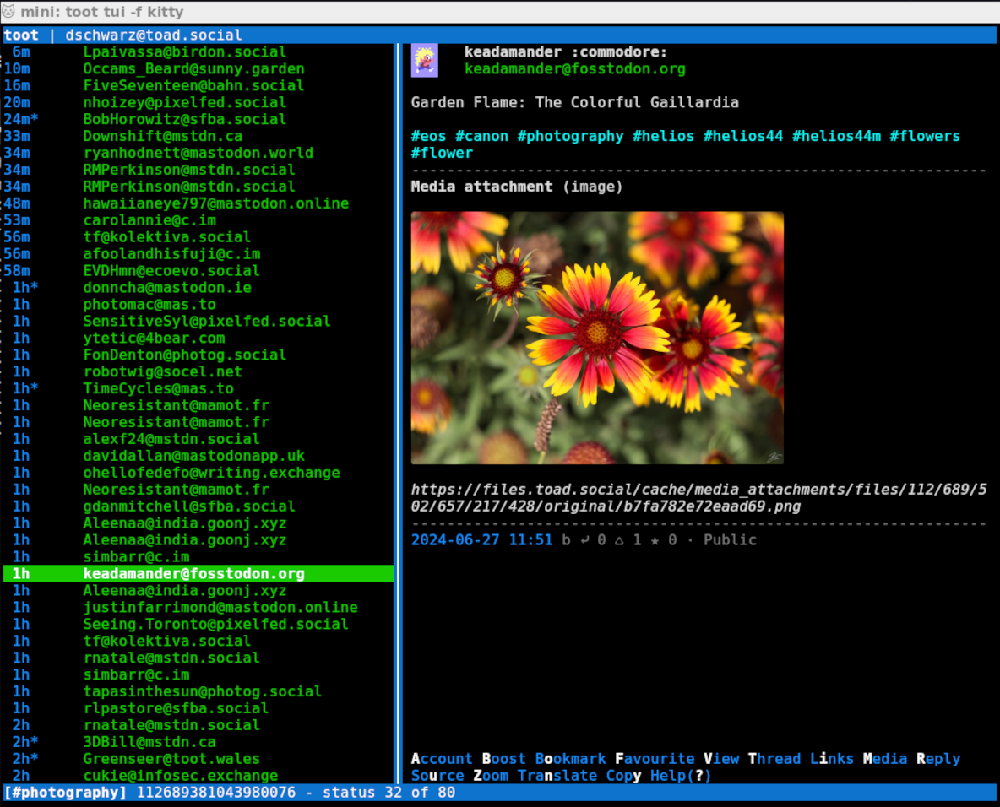
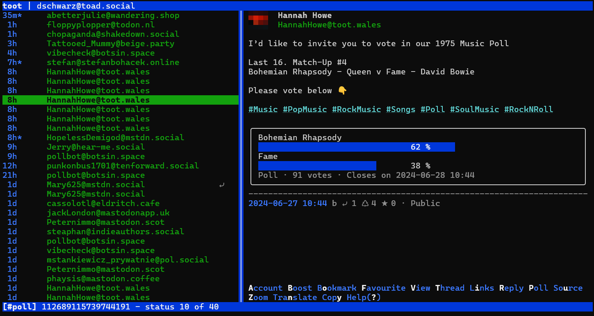
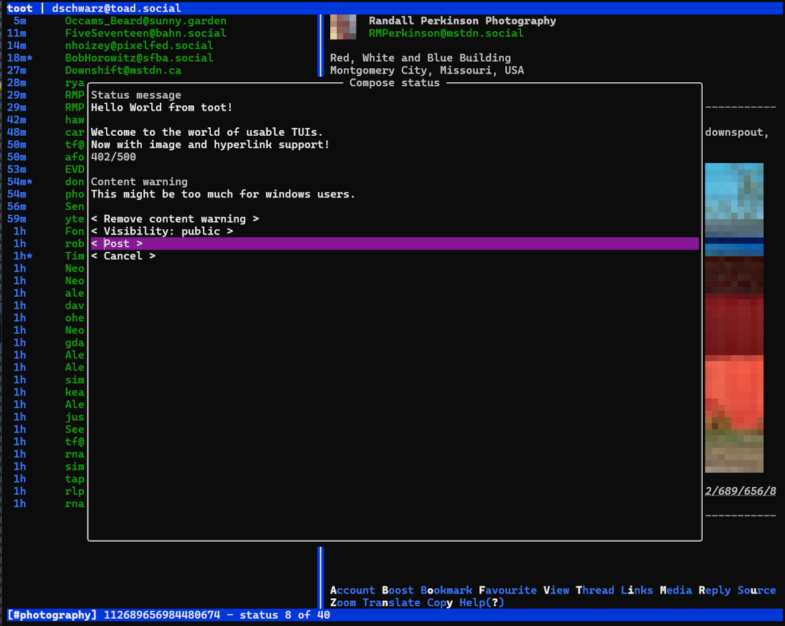

toot - Mastodon CLI client
==========================

Toot is a CLI and TUI tool for interacting with Mastodon (and other compatible) instances from the command line.

Resources
---------

* [Documentation](https://toot.bezdomni.net/)
* [Source code on GitHub](https://github.com/ihabunek/toot)
* [Issues on GitHub](https://github.com/ihabunek/toot/issues)
* [Mailing list on Sourcehut](https://lists.sr.ht/~ihabunek/toot-discuss) for discussion, support and patches
* Informal discussion on the #toot IRC channel on [libera.chat](https://libera.chat/)

Command line client
-------------------

* Posting, replying, deleting, favouriting, reblogging & pinning statuses
* Support for media uploads, spoiler text, sensitive content
* Search by account or hash tag
* Following, muting and blocking accounts
* Simple switching between multiple Mastodon accounts

Terminal User Interface
-----------------------

toot includes a terminal user interface. Run it with `toot tui`.

License
-------

Copyright Ivan Habunek <ivan@habunek.com> and contributors.

Licensed under the [GPLv3](http://www.gnu.org/licenses/gpl-3.0.html) license.
